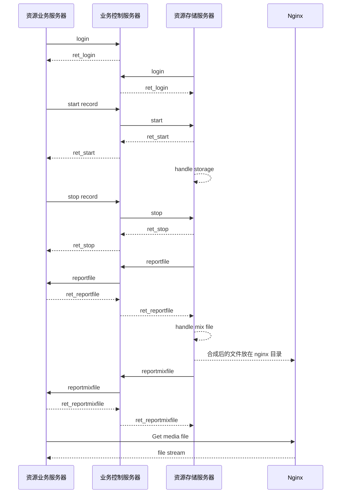
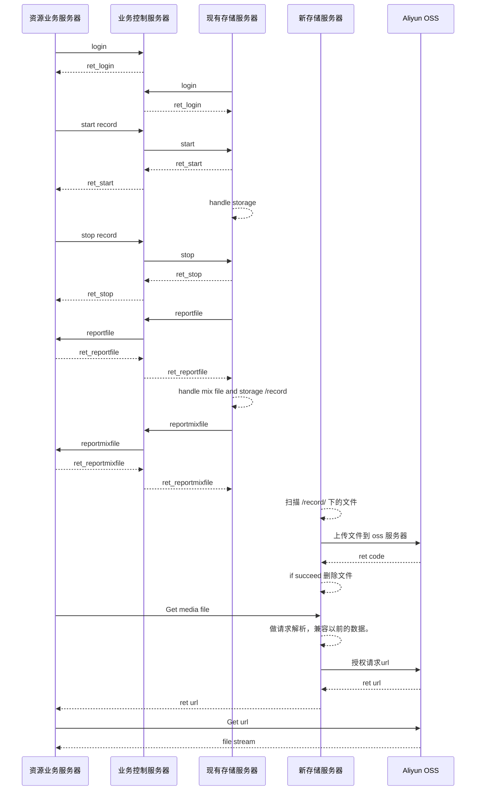

# oss 云存储服务器

## 概述
* 资源业务服务器 
>>> 主要负责图片、消息以及音视频的索引、存储等，负责与前端和存储服务器业务处理和转发。
* 业务控制服务器
>>> 主要负责负载均衡，业务服务器和存储服务器业务转发等功能。
* 资源存储服务器
>>> 主要负责音视频存储，音视频转码和回放管理等功能。
* 新资源存储服务器
>>> 主要负责与云存储服务器的文件上传与下载，授权上传与下载等功能。

## 资源存储服务器

资源存储服务器主要业务如下：  

* 登陆业务服务器
* 开始存储
* 停止存储
* 上报音视频元文件
* 接收合成指令
* 合成完毕后上报合成音视频文件
* ~~通过 nginx 使用回放服务~~

## 新资源存储服务器

新资源存储服务器主要业务如下：
* 获取本地音视频文件
* 上传获取的文件到 oss 服务器并删除本地文件
* ~~上报 oss 服务器文件信息到业务服务器~~
* 接收回放指令并解析所需要的文件信息，返回文件 oss url

业务流程时序图

## Note

* ?